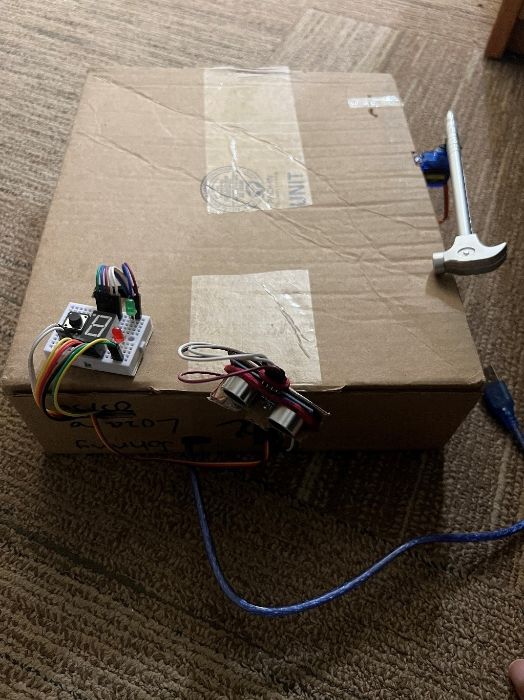

# Red Light – Green Light Game

## Description

This project involves creating a game environment based on the "Red Light – Green Light" game from the popular television series called "Squid Game" using an Arduino Mega and multiple sensors and actuators. The project attempts to recreate a more peaceful version of the game that can be played by a sole player with the use of various sensors and actuators. An ultrasonic sensor attached to a servo motor, red and green LED lights will indicate when to move or stop. A buzzer will generate different tones to indicate each period, and a 7-segment display will show 6 to 0 to indicate the remaining time. The player will have 60 seconds to attempt to make it to the other side, and the 7-segment display will indicate the tens digit of the remaining time (i.e. a 2 will be shown on the 7-segment display if 23 seconds are remaining). The game will start and restart through the use of a push button.

## Components

- 1 x HC-SR04 Ultrasonic Sensor
- 2 x SG90 Servo Motors
- 1 x Red LED
- 1 x Green LED
- 1 x 2 Pin Passive Piezoelectric Buzzer
- 1 x Single Digit 7-Segment LED Display
- 1 x Normally Open Switch Push Button
- 10 x 220 Ω Resistors
- 1 x 10k Ω Resistor
- 1 x Breadboard
- 1 x Arduino Mega 2560 Rev3
- Jumper Wires

## Implementation Steps

1. Set up the 7-segment display.
2. Configure a timer for the game countdown.
3. Set up the external switch push button.
4. Set up the "Red Light" and "Green Light" states with LEDs and a buzzer.
5. Configure the two servo motors.
6. Configure the ultrasonic sensor.
7. Set up the game board.

## Demo

Here are some images demonstrating the project:

## Conclusion

In conclusion, the project demonstrates the successful application of creative problem-solving skills and advanced hardware and software integration techniques to create a more peaceful version of a popular game from the television series "Squid Game" that can be played by a single player. The implementation steps involved setting up various components such as the 7-segment display, timer, external switch push button, "Red Light" and "Green Light" states, servo motors, ultrasonic sensor, and game board. The project workload included planning, component-assembly, coding, testing, and the final design implementation. Overall, this project showcases the versatility and potential of sensors and actuators in the development of innovative game environments.
